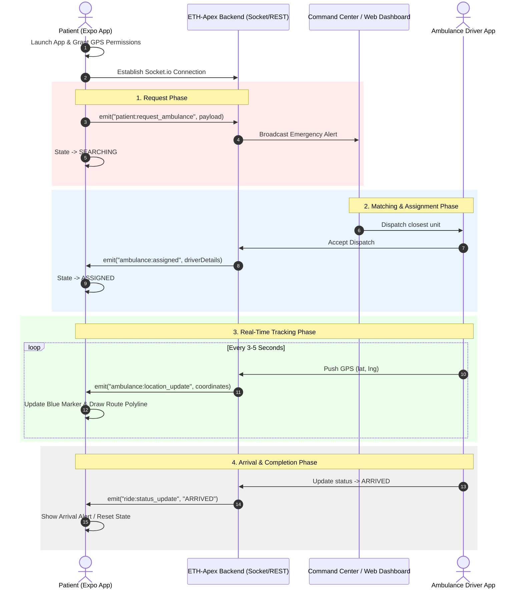

# ETH-Apex Patient Mobile App (React Native & Expo)

Complete developer guide, end-to-end application workflow, network connectivity architecture, and production starter code for the ETH-Apex Android Patient Client.

---

## 1. Application Workflow

### End-to-End Emergency & Booking Sequence



### State Machine Diagram

```
 [ IDLE ] ──(Tap SOS/Book)──> [ SEARCHING ] ──(Driver Accepts)──> [ ASSIGNED ]
    ▲                             │                                   │
    │                      (Tap Cancel)                         (GPS Updates)
    │                             │                                   ▼
 [ COMPLETED / IDLE ] <──(Driver Arrives)─────────── [ EN_ROUTE ]
```

---

## 2. Connectivity & Data Synchronization Architecture

### Connection Protocol & Stack
- **Primary Transport**: WebSockets over Socket.io (`transports: ['websocket']`) for real-time sub-second position updates and instant alert propagation.
- **REST API Fallback**: Standard HTTP REST endpoints for initial auth, historical logs, or background backup sync (`POST /api/v1/emergency/sos`).

### Network Environment Configuration
- **Local Development / Emulator**:
  - Android Emulator loopback: `http://10.0.2.2:5000`
  - Physical Android Device (same Wi-Fi): `http://<YOUR_LOCAL_IP>:5000` (e.g., `http://192.168.1.100:5000`)
- **Production Server**:
  - Secure HTTPS/WSS: `wss://api.ethapex.com`

### Auto-Reconnection & Resiliency
```javascript
// Resilient Socket.io initialization pattern
const socket = io(BACKEND_URL, {
  transports: ['websocket'],
  reconnection: true,
  reconnectionAttempts: 10,
  reconnectionDelay: 2000,
  timeout: 10000,
});
```

---

## 3. Event Contract (Socket.io)

| Event Name | Direction | Payload Structure | Description |
|---|---|---|---|
| `patient:request_ambulance` | Client -> Server | `{ patientId, emergencyType, location: { lat, lng }, timestamp }` | Triggers SOS request from patient |
| `patient:cancel_request` | Client -> Server | `{ patientId }` | Cancels active booking request |
| `ambulance:assigned` | Server -> Client | `{ ambulanceId, driverName, driverPhone, location: { lat, lng } }` | Received when a driver accepts assignment |
| `ambulance:location_update` | Server -> Client | `{ lat, lng }` | Streams incoming driver GPS coordinates |
| `ride:status_update` | Server -> Client | `'SEARCHING'` \| `'ASSIGNED'` \| `'EN_ROUTE'` \| `'ARRIVED'` | State transition events |

---

## 4. Quickstart Setup

```bash
# Initialize Expo App
npx create-expo-app ETHApexPatient --template blank
cd ETHApexPatient

# Install Native Dependencies & Socket Client
npx expo install expo-location react-native-maps
npm install socket.io-client
```

---

## 5. Complete Client Implementation (`App.js`)

```jsx
import React, { useState, useEffect, useRef } from 'react';
import {
  StyleSheet,
  Text,
  View,
  TouchableOpacity,
  Alert,
  ActivityIndicator,
  SafeAreaView,
  StatusBar,
} from 'react-native';
import MapView, { Marker, Polyline } from 'react-native-maps';
import * as Location from 'expo-location';
import { io } from 'socket.io-client';

// Change to your backend server IP or domain
const BACKEND_URL = 'http://192.168.1.100:5000';

export default function App() {
  const [userLocation, setUserLocation] = useState(null);
  const [bookingStatus, setBookingStatus] = useState('IDLE'); // IDLE, SEARCHING, ASSIGNED, EN_ROUTE, ARRIVED
  const [assignedAmbulance, setAssignedAmbulance] = useState(null);
  const [ambulanceLocation, setAmbulanceLocation] = useState(null);

  const socketRef = useRef(null);
  const mapRef = useRef(null);

  useEffect(() => {
    // Request GPS Permissions & get position
    (async () => {
      let { status } = await Location.requestForegroundPermissionsAsync();
      if (status !== 'granted') {
        Alert.alert('Permission Denied', 'Location access is required for ambulance dispatch.');
        return;
      }

      let location = await Location.getCurrentPositionAsync({});
      setUserLocation({
        latitude: location.coords.latitude,
        longitude: location.coords.longitude,
        latitudeDelta: 0.01,
        longitudeDelta: 0.01,
      });
    })();

    // Socket Initialization
    socketRef.current = io(BACKEND_URL, {
      transports: ['websocket'],
      reconnection: true,
    });

    socketRef.current.on('connect', () => {
      console.log('Connected to ETH-Apex Network:', socketRef.current.id);
    });

    socketRef.current.on('ambulance:assigned', (data) => {
      setBookingStatus('ASSIGNED');
      setAssignedAmbulance(data);
      if (data.location) {
        setAmbulanceLocation({
          latitude: data.location.lat,
          longitude: data.location.lng,
        });
      }
    });

    socketRef.current.on('ambulance:location_update', (locationData) => {
      setAmbulanceLocation({
        latitude: locationData.lat,
        longitude: locationData.lng,
      });
    });

    socketRef.current.on('ride:status_update', (status) => {
      setBookingStatus(status);
    });

    return () => {
      if (socketRef.current) socketRef.current.disconnect();
    };
  }, []);

  const handleBookAmbulance = (emergencyType = 'GENERAL_EMERGENCY') => {
    if (!userLocation) {
      Alert.alert('Locating...', 'Fetching GPS coordinates...');
      return;
    }

    setBookingStatus('SEARCHING');

    socketRef.current.emit('patient:request_ambulance', {
      patientId: socketRef.current.id,
      emergencyType,
      location: {
        lat: userLocation.latitude,
        lng: userLocation.longitude,
      },
      timestamp: new Date().toISOString(),
    });
  };

  const handleCancel = () => {
    socketRef.current.emit('patient:cancel_request');
    setBookingStatus('IDLE');
    setAssignedAmbulance(null);
    setAmbulanceLocation(null);
  };

  return (
    <SafeAreaView style={styles.container}>
      <StatusBar barStyle="dark-content" />

      {userLocation ? (
        <MapView
          ref={mapRef}
          style={styles.map}
          initialRegion={userLocation}
          showsUserLocation={true}
        >
          <Marker coordinate={userLocation} title="Your Location" pinColor="red" />
          {ambulanceLocation && (
            <Marker coordinate={ambulanceLocation} title="Ambulance" pinColor="blue" />
          )}
          {ambulanceLocation && (
            <Polyline coordinates={[userLocation, ambulanceLocation]} strokeColor="#2563EB" strokeWidth={4} />
          )}
        </MapView>
      ) : (
        <View style={styles.loadingContainer}>
          <ActivityIndicator size="large" color="#DC2626" />
          <Text style={styles.loadingText}>Acquiring GPS Signal...</Text>
        </View>
      )}

      <View style={styles.overlay}>
        {bookingStatus === 'IDLE' && (
          <View style={styles.card}>
            <Text style={styles.title}>ETH-Apex Emergency</Text>
            <TouchableOpacity style={[styles.button, styles.sosButton]} onPress={() => handleBookAmbulance('CRITICAL_SOS')}>
              <Text style={styles.sosButtonText}>SOS EMERGENCY</Text>
            </TouchableOpacity>
          </View>
        )}

        {bookingStatus === 'SEARCHING' && (
          <View style={styles.card}>
            <ActivityIndicator size="large" color="#DC2626" />
            <Text style={styles.statusText}>Searching for available Ambulance...</Text>
            <TouchableOpacity style={styles.cancelButton} onPress={handleCancel}>
              <Text style={styles.cancelText}>Cancel</Text>
            </TouchableOpacity>
          </View>
        )}

        {(bookingStatus === 'ASSIGNED' || bookingStatus === 'EN_ROUTE') && (
          <View style={styles.card}>
            <Text style={styles.statusTitle}>Ambulance En Route</Text>
            {assignedAmbulance && (
              <Text style={styles.driverText}>Unit: {assignedAmbulance.ambulanceId} | Driver: {assignedAmbulance.driverName}</Text>
            )}
            <TouchableOpacity style={styles.cancelButton} onPress={handleCancel}>
              <Text style={styles.cancelText}>Cancel</Text>
            </TouchableOpacity>
          </View>
        )}
      </View>
    </SafeAreaView>
  );
}

const styles = StyleSheet.create({
  container: { flex: 1, backgroundColor: '#fff' },
  map: { width: '100%', height: '100%' },
  loadingContainer: { flex: 1, justifyContent: 'center', alignItems: 'center' },
  loadingText: { marginTop: 12, fontSize: 16, color: '#666' },
  overlay: { position: 'absolute', bottom: 24, left: 16, right: 16 },
  card: { backgroundColor: '#fff', borderRadius: 16, padding: 20, elevation: 6 },
  title: { fontSize: 22, fontWeight: '700', color: '#111827', marginBottom: 12 },
  button: { paddingVertical: 14, borderRadius: 10, alignItems: 'center' },
  sosButton: { backgroundColor: '#DC2626' },
  sosButtonText: { color: '#FFF', fontWeight: '800', fontSize: 16 },
  statusText: { textAlign: 'center', marginTop: 12, fontSize: 16 },
  statusTitle: { fontSize: 18, fontWeight: '700', color: '#2563EB', marginBottom: 8 },
  driverText: { fontSize: 14, color: '#374151', marginVertical: 4 },
  cancelButton: { marginTop: 8, padding: 10, alignItems: 'center' },
  cancelText: { color: '#EF4444', fontWeight: '600' },
});
```

---

## 6. Android-Specific Native Configuration (`app.json`)

To build a production-ready Android client with real-time location mapping, you must configure target permissions, descriptions, and native API keys inside `app.json`.

```json
{
  "expo": {
    "name": "ETH-Patients",
    "slug": "ETH-Patients",
    "version": "1.0.0",
    "orientation": "portrait",
    "icon": "./assets/images/icon.png",
    "scheme": "ethpatients",
    "userInterfaceStyle": "automatic",
    "android": {
      "package": "com.ethapex.patient",
      "permissions": [
        "ACCESS_COARSE_LOCATION",
        "ACCESS_FINE_LOCATION",
        "FOREGROUND_SERVICE"
      ],
      "config": {
        "googleMaps": {
          "apiKey": "AIzaSyD_EXAMPLE_YOUR_GOOGLE_MAPS_ANDROID_API_KEY"
        }
      },
      "usesCleartextTraffic": true
    },
    "plugins": [
      "expo-router",
      [
        "expo-location",
        {
          "locationAlwaysPermission": "Allow ETH-Apex to access your location to dispatch emergency ambulances to you.",
          "locationWhenInUsePermission": "Allow ETH-Apex to access your location in the foreground to map and track your ambulance.",
          "isAndroidBackgroundLocationEnabled": false
        }
      ]
    ]
  }
}
```

> [!IMPORTANT]
> **Google Maps API Key**: For standalone APK/AAB release builds, `react-native-maps` requires a valid Google Maps Android SDK API key configured in `android.config.googleMaps.apiKey`. Make sure this key is restricted in the Google Cloud Console to your application's SHA-1 fingerprint.

---

## 7. Network & Connectivity Architecture

### Cleartext Traffic Constraints
Starting with Android 9 (API level 28), cleartext HTTP traffic (i.e. unencrypted `http://`) is disabled by default. Running your server locally (`http://10.0.2.2:5000` or `http://192.168.x.x:5000`) will cause immediate connection failures unless configured:
1. **Expo Config (Recommended)**: Set `"usesCleartextTraffic": true` under `expo.android` in `app.json` (as shown above). Expo will inject this into the generated `AndroidManifest.xml` during prebuild.
2. **Network Security Config**: In custom native environments, declare a network security configuration xml resource allowing cleartext to target development domains.

### Socket.io Lifecycle under Network Switches
In real-world emergency scenarios, a patient might move from home Wi-Fi to a Cellular connection. This transition drops the TCP connection, causing the socket to disconnect.
- **Auto-Reconnection Flow**: The client Socket.io configuration automatically retries connection using exponential backoff (`reconnectionDelay` and `reconnectionAttempts`).
- **Telemetry Buffering**: During drops, status updates and cancel calls are queued or fall back to REST.
- **Connection Diagnostics**: The UI should display connection banners reflecting current socket states:

```javascript
// Example network monitoring connection hook
import NetInfo from '@react-native-community/netinfo';

useEffect(() => {
  const unsubscribe = NetInfo.addEventListener(state => {
    console.log("Connection type", state.type);
    console.log("Is connected?", state.isConnected);
    if (!state.isConnected) {
      Alert.alert("Connection Lost", "Please check your internet settings.");
    }
  });
  return () => unsubscribe();
}, []);
```

---

## 8. Production Resiliency & Client State Optimization

### REST SOS Fallback
When network bandwidth is highly constrained, WebSockets may fail to establish. A secondary REST API fallback ensures the critical SOS payload still reaches the dispatch center.

```javascript
// Fallback function when socket is disconnected or fails to emit
const sendSOSFallback = async (emergencyType, userLocation) => {
  try {
    const response = await fetch('https://api.ethapex.com/api/v1/emergency/sos', {
      method: 'POST',
      headers: {
        'Content-Type': 'application/json',
      },
      body: JSON.stringify({
        patientId: 'device-id-fallback',
        emergencyType,
        location: {
          lat: userLocation.latitude,
          lng: userLocation.longitude,
        },
        timestamp: new Date().toISOString(),
      }),
    });
    const result = await response.json();
    return result.success;
  } catch (error) {
    console.error("SOS Emergency fallback request failed:", error);
    return false;
  }
};
```

### State Persistence (AsyncStorage)
To prevent active tracking sessions from being lost when the app crashes, is closed, or is restarted, store the tracking state in `AsyncStorage`.

```javascript
import AsyncStorage from '@react-native-async-storage/async-storage';

// Keys for persistence
const STATE_PERSIST_KEY = '@ETH_Apex:BookingState';

// Save State on Change
const persistState = async (status, ambulance, location) => {
  try {
    const payload = JSON.stringify({ status, ambulance, location });
    await AsyncStorage.setItem(STATE_PERSIST_KEY, payload);
  } catch (e) {
    console.error("Failed to save booking state:", e);
  }
};

// Restore State on Launch
const restoreState = async () => {
  try {
    const val = await AsyncStorage.getItem(STATE_PERSIST_KEY);
    if (val !== null) {
      const { status, ambulance, location } = JSON.parse(val);
      if (status !== 'IDLE') {
        setBookingStatus(status);
        setAssignedAmbulance(ambulance);
        setAmbulanceLocation(location);
        // ponytail optimization: Re-connect socket and join room for active dispatch tracking
        socketRef.current.emit('patient:rejoin_session', { ambulanceId: ambulance.ambulanceId });
      }
    }
  } catch (e) {
    console.error("Failed to restore booking state:", e);
  }
};
```

---

## 9. Verification, Debugging & GPS Simulation Playbook

### Local Mock Server Script (`mock-server.js`)
To verify the complete patient client socket flow, run this lightweight Mock Socket.io server locally.

```javascript
// Create file: mock-server.js
// Install: npm install express socket.io
const express = require('express');
const http = require('http');
const { Server } = require('socket.io');

const app = express();
const server = http.createServer(app);
const io = new Server(server, { cors: { origin: '*' } });

io.on('connection', (socket) => {
  console.log('Client connected:', socket.id);

  socket.on('patient:request_ambulance', (payload) => {
    console.log('SOS Request Received:', payload);
    
    // Step 1: Transition client status to SEARCHING
    socket.emit('ride:status_update', 'SEARCHING');

    // Step 2: Simulate dispatch driver assignment after 3 seconds
    setTimeout(() => {
      const mockDriver = {
        ambulanceId: 'AMB-APEX-09',
        driverName: 'John Doe',
        driverPhone: '+1-555-0199',
        location: { lat: payload.location.lat + 0.005, lng: payload.location.lng + 0.005 }
      };
      
      socket.emit('ambulance:assigned', mockDriver);
      socket.emit('ride:status_update', 'ASSIGNED');

      // Step 3: Simulate active movement en-route (location telemetry loop)
      let currentLat = mockDriver.location.lat;
      let currentLng = mockDriver.location.lng;
      let step = 0;

      const telemetryInterval = setInterval(() => {
        if (step >= 5) {
          clearInterval(telemetryInterval);
          socket.emit('ride:status_update', 'ARRIVED');
          console.log('Simulated arrival complete.');
          return;
        }

        // Interpolate moving towards user
        currentLat -= 0.001;
        currentLng -= 0.001;
        
        socket.emit('ambulance:location_update', { lat: currentLat, lng: currentLng });
        console.log(`Telemetry push step ${step + 1}:`, { lat: currentLat, lng: currentLng });
        step++;
      }, 3000);

    }, 3000);
  });

  socket.on('patient:cancel_request', () => {
    console.log('Request cancelled by patient.');
  });
});

server.listen(5000, () => console.log('Mock ETH-Apex Server listening on port 5000'));
```

### Emulator GPS Simulation Setup
1. **Extended Controls**: In the Android Emulator sidebar, click the **More (...)** button, select **Location**, and manually input coordinates. Click **Send** to instantly update coordinates in `expo-location`.
2. **GPX / KML Route Playback**: Generate a route on Google Maps, export as a GPX file, and load it into the emulator location controller. Enable play to simulate continuous real-time driver/user travel.
3. **ADB Shell Mocking**:
   ```bash
   # Enable mock locations
   adb shell appops set com.ethapex.patient android:mock_location allow
   
   # Inject GPS coordinate
   adb shell geo fix <longitude> <latitude>
   ```
